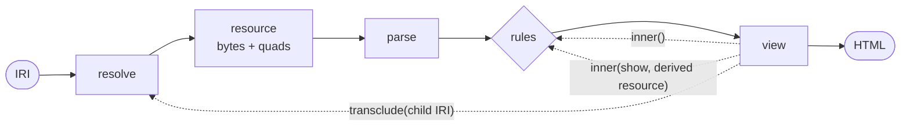

A view receives a resource and must answer HTML. Vitrine itself is the same
function: a resource goes in, HTML comes out. A view can therefore call it
again, for the resource it was handed, for another IRI, or for a resource it
made up, and put what comes back into its own answer.



The solid path is one rendering. The dashed edges are the three ways a view
calls back into it:

| Call | What goes back in | Where it enters |
|---|---|---|
| `ctx.transclude(iri, show?)` | another IRI, or this one with a fragment | resolve: the child is fetched, parsed and chosen for on its own |
| `ctx.inner(show?)` | this resource | the rules: the view below the calling one is chosen, passing over every view already drawing it |
| `ctx.inner(show, resource)` | a resource the view derived | the rules: the derived resource is chosen for by its own content type and types |

## A view that draws nothing

A view does not have to draw anything itself. The subjects view that ships
with the library is little more than a loop: it takes a graph apart into the
things it describes and transcludes each one. The card for a person and the
table for everything else come from the rules.

```ts
async render (resource, ctx) {
  const prefix = `${resource.iri}#`
  const fragments = [...new Set(resource.quads.map((q) => q.subject.value))]
    .filter((subject) => subject.startsWith(prefix))
    .map((subject) => subject.slice(prefix.length))
  const cells = await Promise.all(
    fragments.map((fragment) => ctx.transclude(resource.iri, { fragment }))
  )
  return { html: cells.join('') }
}
```

Each transcluded child is an instance of its own, with its own view, its own
state and its own updates. The parent only decided what the children are.

## A view that only maps

The same holds one step further. A view can take the graph it was handed, turn
it into another shape, and hand the result on. The rules then draw the new
shape with whatever view it calls for. It behaves like a CONSTRUCT query that
sits among the views: a vCard becomes a schema.org person, and the person card
draws it without ever having heard of vCard.

```ts
import { rdf, schema } from '@aleph-garden/terms'
import type { Quad, Resource, View } from '@aleph-garden/vitrine'

const vcard = 'http://www.w3.org/2006/vcard/ns#'

export const vcardAsPerson: View = {
  id: 'https://example.org/views#VCardAsPerson',
  when: [{ type: `${vcard}Individual` }],

  async render (resource, ctx) {
    const subject = { termType: 'NamedNode', value: ctx.about().iri } as const
    const name = ctx.about().one(`${vcard}fn`) ?? ''
    const person: Resource = {
      ...resource,
      quads: [
        { subject, predicate: { termType: 'NamedNode', value: rdf.type }, object: { termType: 'NamedNode', value: schema.Person } },
        { subject, predicate: { termType: 'NamedNode', value: schema.name }, object: { termType: 'Literal', value: name } }
      ] satisfies Quad[]
    }
    return ctx.inner({}, person)
  }
}
```

`inner` passes over the mapping view below itself, so a mapping never maps its
own output again. What comes back is drawn HTML with its `hydrate`, and the
mapping view answers it as its own.

Mappings compose the way wrappers do. A mapping can hand its result to a
wrapper, a wrapper can wrap a mapping, and none of them knows what is below it
beyond the resource it handed on.

## Where the recursion stops

Each call goes through the same selection a host's first call does, so the
same guards apply:

- A child that is already an ancestor is left as a placeholder instead of
  mounted again. What counts as the same is the IRI together with the fragment
  it shows, so a document embedding its own subjects is no cycle, while a
  subject embedding itself is.
- Past a depth the host sets, children stay placeholders until a reader asks
  for them.
- `inner` passes over every view already drawing the resource, and rejects
  when none is left.
