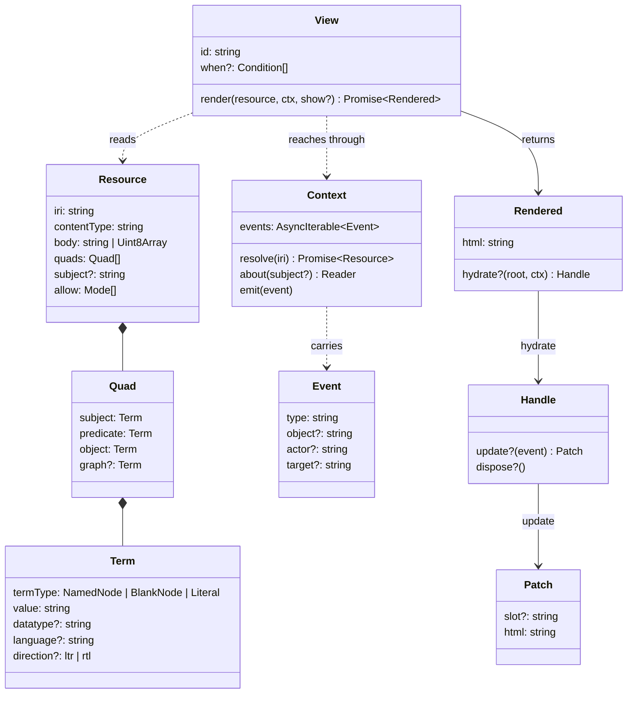

Every type here is plain data with no methods, so that a `Resource` can be
cached, serialized, or handed across an ABI boundary unchanged. That
constraint is what keeps a WASM view possible later.



## What you call

The types below are what crosses the boundary. These are the functions that
move things across it, and they are the whole exported surface a view or a
host uses.

| From | What it does |
|---|---|
| `createRenderer(registry)` | parse, select, render over a registry of parsers, views and rules |
| `createRuntime(renderer, resolve)` | a DOM host's instances: `mount`, `dispatch`, `instances`, `listen` |
| `instanceContext(resolve, emit, events)` | the `Context` a runtime hands one instance, exposed so a view test can build one |
| `linkEvents(region, emit)` | turns a click on a link inside a region into an `as:View` event |
| `writeHtml(target, html)` | the sanitised write every mount and patch goes through |
| `VIEW_ATTR`, `IRI_ATTR` | the attributes the runtime writes on every region it holds: the view's id and the resource |
| `about(resource, subject?)` | a reader over the resource's statements, see [Reading statements](#reading-statements) |
| `objects(quads, subject, predicate)` | the object terms of matching quads |
| `isContainer(resource)`, `typesOf(resource)` | the two questions that come up constantly |
| `subjectsGridView`, `subjectsListView`, `sourceView`, `fallbackView`, `containerView` | the built-in views |
| `escapeHtml(text)` | escape a value before it lands in HTML |
| `holds(condition, resource)` | evaluate one condition, the way selection does |
| `ns(base, ...names)` | declare a vocabulary, from `@aleph-garden/terms` |

`createRenderer` and the quad helpers come from `@aleph-garden/vitrine`;
`createRuntime`, `instanceContext`, `linkEvents` and `writeHtml` from
`@aleph-garden/vitrine/dom`, which is the half that touches the DOM.

## Resource

An IRI is a URL that may also contain characters beyond ASCII, so
`https://müller.example/über-uns` is one where a URL would need percent
encoding. Nothing here depends on the difference; the word is RDF's and the
contract uses it throughout.

```ts
type Resource = {
  iri: string
  contentType: string
  body: string | Uint8Array
  quads: Quad[]     // everything known about the IRI, one dataset
  subject?: string  // the subject this rendering is about; absent: the IRI
  allow: Mode[]     // "read" | "write" | "append" | "control"
}
```

Seen from the front, a resource is two things: `body` and `contentType` for
the bytes, `quads` for the statements. The quads form one dataset, and each
quad's `graph` says where it came from:

| Graph | Holds | Filled by |
|---|---|---|
| the resource's own IRI | what the body says | the renderer, from what the parser read |
| `vitrine:Meta` | what is known about the resource from outside its content: its type as the store states it, when it changed, its members, its media type | the host's resolver, from whatever its transport tells: HTTP headers, file metadata |
| another document's IRI | what a document the resolver brought in says, `describedby` metadata for one | the resolver |

The first and the third follow the usual Linked Data convention: a graph is
named by the document its statements came from. `vitrine:Meta` is this
library's own name for statements with no document behind them. A view
rarely needs any of this, because [`about`](#reading-statements) reads the
union.

`subject` is set by the renderer when `show.fragment` names a subject the
quads describe, `iri#fragment`. Selection tests `type` conditions on it and
`about` stands on it, so a view draws one subject of a document with the same
code it would use for a whole resource.

`allow` stays outside the quads because it is a fact about this request and
never about the resource: the same resource answers a different `WAC-Allow`
to every agent. Among the quads, a cached `Resource` would carry one agent's
permissions to another.

### Quads and terms

```ts
type Quad = { subject: Term; predicate: Term; object: Term; graph?: Term }

type Term = {
  termType: 'NamedNode' | 'BlankNode' | 'Literal'
  value: string
  datatype?: string          // every Literal has one
  language?: string          // present iff datatype is rdf:langString
  direction?: 'ltr' | 'rtl'  // RDF 1.2 base direction, with language
}
```

These follow the RDF/JS shape without the prototypes. A view that wants a
store loads them into one; the core never does.

### Reading statements

```ts
about(resource).one(schema.name)             // every graph, the usual case
about(resource).meta.one(dcterms.modified)   // only what is known from outside
about(resource).content.all(schema.knows)    // only what the body says
about(resource).from(docA, docB)             // the union of the graphs named
```

`about(resource)` stands on the subject the rendering is about and reads every
graph. `.from(...graphs)` restricts to the union of the graphs it names;
`.meta` and `.content` are the two restrictions a view needs most. A
restriction applied to a restricted reader narrows it further, so
`about(r).meta.from(doc)` is the statements in both, which is usually none.
`node(predicate)` moves to the object and keeps the restriction.

```ts
type Reader = {
  readonly iri: string
  terms(predicate): Term[]
  all(predicate, { lang? }): string[]
  one(predicate, { lang? }): string | undefined
  node(predicate): Reader
  from(...graphs: string[]): Reader
  readonly meta: Reader
  readonly content: Reader
}
```

## Context

```ts
type Context = {
  resolve(iri: string): Promise<Resource>
  about(subject?: string): Reader
  emit(event: Event): void
  events: AsyncIterable<Event>
  transclude(iri: string, show?: Show): Promise<string>
  render(resource?: Resource, show?: Show): Promise<Rendered & { view: View }>
  state<T>(key: string, initial: T): State<T>
  state<T = string>(key: string): State<T | undefined>
}

type State<T> = { get(): T; set(value: T): void }
```

`resolve` is the only way a view reaches anything beyond the resource it was
handed. The host implements it; a view never fetches. A SPARQL query is a
GET on an endpoint IRI with the query in the query string, so it goes
through `resolve` like everything else. Whether the host answers that IRI
over the network or from a store it holds in memory is the host's business.

The resource `resolve` answers is parsed the same way as the one a view is
handed: when a registered parser reads its content type, its quads hold what
the body says. A view that needs another document as RDF reads it with
`about` and never parses `body` itself.

`about` is `about(resource)` for the resource being drawn, without the import.
Given a subject it reads that one instead.

`transclude` is on [Transclusion](/vitrine/docs/reference/transclusion/).
`render` draws a resource the way vitrine draws any, and answers the HTML with
`hydrate` and the view that drew it. Without a resource it draws the same one
with the view that would have drawn it were the calling view not there, which
is how a view wraps another; [Wrapper views](/vitrine/docs/author/wrappers/)
has it. Given a `resource`, it draws that one, which is how a view hands on a
graph it derived; [Compose views](/vitrine/docs/author/compose/) has it. A
view is passed over only where it already draws the same resource with the
same focus in this render, and nested calls stop after `RENDER_DEPTH`, eight
unless the host sets `renderDepth`.

`state` keeps a value for this view in this instance. It survives every
re-render of the instance, `set` draws the instance again, and a remount
starts it over. Keys are scoped to the view that asks, so a wrapper and the
view inside it never see each other's. Values stay within what JSON carries,
so a host can keep them past the instance later. [Wrapper
views](/vitrine/docs/author/wrappers/#state) shows it in use.

## Event

An event is an ActivityStreams 2.0 activity as a plain object: the same
shape a Solid server's notification channels emit, so a server notification
enters the bus without translation.

```ts
type Event = {
  type: string      // an IRI; AS2 types where one fits
  object?: string   // the IRI the activity is about
  actor?: string    // the view instance that emitted it
  target?: string
  [key: string]: unknown
}
```

| Type | Meaning |
|---|---|
| `as:Update` | a resource changed |
| `as:View` | navigate to a resource, or to a fragment of the current one |
| `aleph:Select` | a view marked a resource; AS2 has no type for it |

Events carry meaning, never DOM detail. A view emits `aleph:Select`, never
`click`.

## View, Rendered, Handle, Patch

```ts
type View = {
  id: string                  // an IRI
  when?: Condition[]          // see Selection
  render(resource: Resource, ctx: Context, show?: Show): Promise<Rendered>
}

type Rendered = {
  html: string
  hydrate?(root: Element, ctx: Context): Handle | void
}

type Handle = {
  update?(event: Event): Patch | void
  dispose?(): void
}

type Patch = {
  slot?: string   // a data-slot value inside the view's region
  html: string    // replaces that slot, or the whole region when absent
}
```

`render` produces a string, so a view needs no DOM to exist. `hydrate` is
where a view attaches behavior after the host has placed the HTML. A view
that wants partial updates marks elements in its own HTML with `data-slot`
and patches by name.

## Show

```ts
type Show = {
  view?: string       // a View id
  fragment?: string   // the fragment of the requested IRI, without "#"
  clip?: boolean      // show the fragment alone
}
```

What of a resource to show, and how. The host sets it for a region, and a
view sets it for a child it transcludes. `view` names the view to draw with
and wins over every rule; `fragment` names what within the resource to bring
forward: a heading or block in a note, a subject in an RDF document; `clip`
asks for that part alone. A `view` that is not registered is ignored and the rules decide.

When the quads describe `iri#fragment`, the fragment becomes the resource's
`subject`: selection and `about` then work on that subject. A fragment that
names no subject, a heading in Markdown for one, leaves the subject on the
IRI.

## Parser

```ts
type Parser = {
  contentType: string | RegExp
  parse(resource: Resource): Promise<Quad[]>
}
```

Runs before selection so that selection can look at `rdf:type`. A host
registers the parsers it wants; the core ships none, since each brings an
RDF library. The first parser registered for a content type is the one that
runs, and whatever it answers goes into the graph named by the resource's IRI.
A parser that reads a dataset format keeps the graphs it found; only its
default graph becomes the document's.

A parser is not limited to RDF formats. One that reads EXIF out of a JPEG
adds statements about an image, and the image stays an image: which reading
of a resource is drawn by default is up to the rules.
