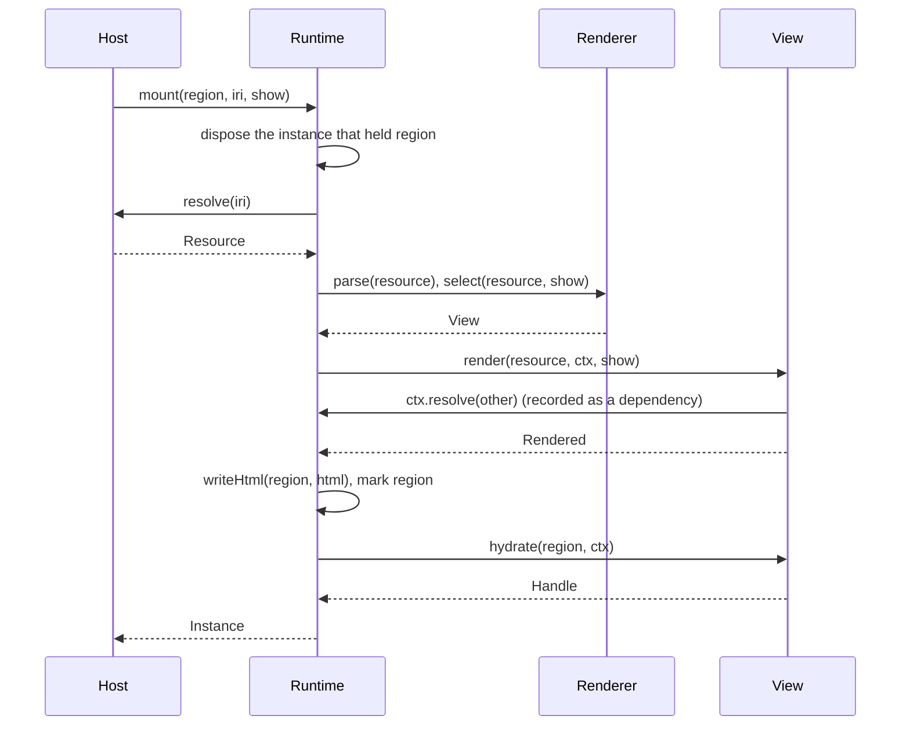
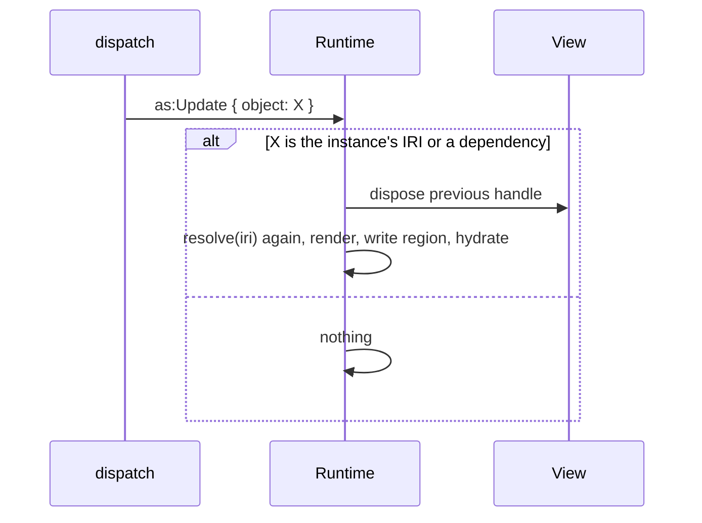
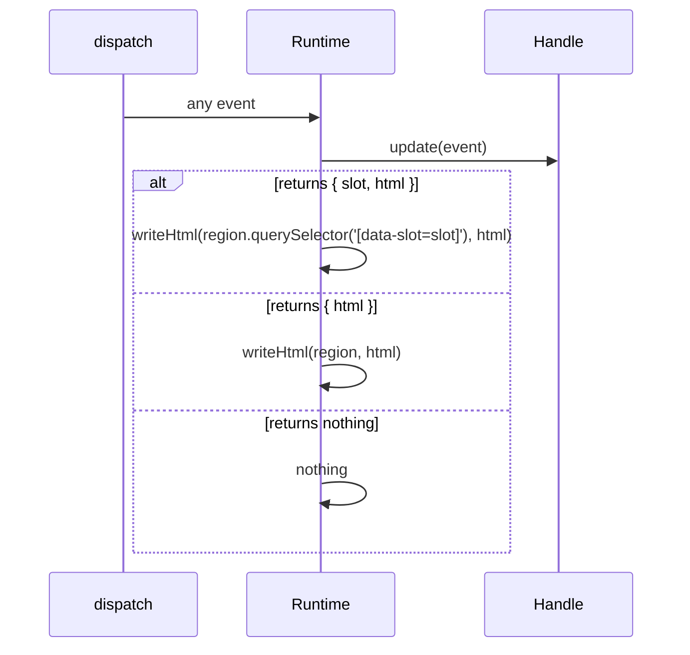
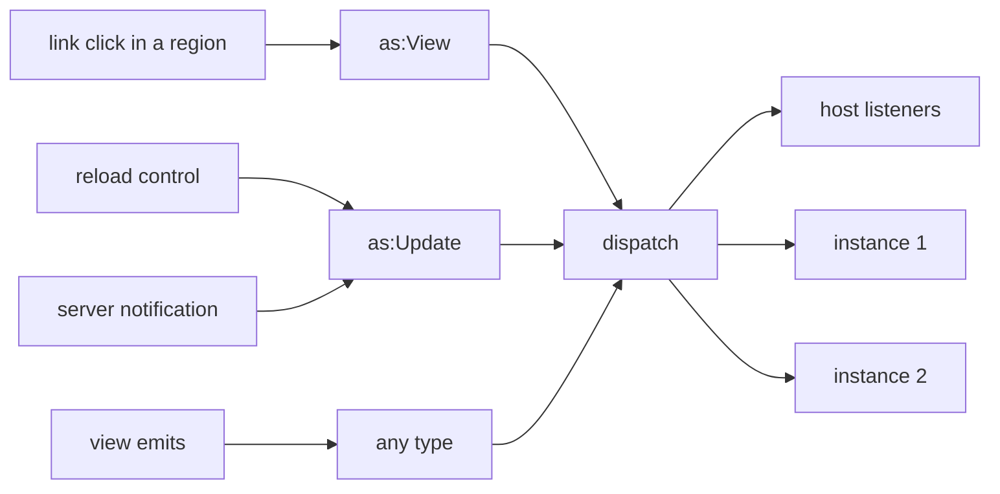

A DOM host keeps, per view instance, its region element, the handle
`hydrate` returned, and the set of IRIs the instance resolved. The core
ships this bookkeeping as a runtime, so every browser host runs the same
protocol.

```ts
type Runtime = {
  mount(region: Element, iri: string, show?: Show): Promise<Instance>
  dispatch(event: Event): Promise<void>
  instances(): Instance[]
  listen(listener: (event: Event) => void): () => void
}

type Instance = {
  id: string
  iri: string
  show: Show | undefined
  region: Element
  dependencies: ReadonlySet<string>   // IRIs resolved during the last render
  dispose(): void
}
```

## Mount



`mount` rejects when `resolve` rejects, so the host can act on a `401`.

Every region the runtime holds carries two attributes: `data-aleph-view` with
the id of the view that drew it, and `data-aleph-iri` with the resource. A
re-render under another view moves the first, and a mount that rejects
removes both. The browser's element inspector then shows which view drew
what, transcluded children included, and a stylesheet can scope a view's
rules to it:

```css
@scope ([data-aleph-view="https://aleph.garden/views/container"]) to ([data-aleph-view]) {
  .child { padding: 0.3em 0; }
}
```

The lower bound stops the rules at the next region down, so a view's `.child`
does not style a transcluded child's `.child`. The region names the outermost
view. A view drawn inside a wrapper carries its own id on the element that
holds it (see [Wrapper views](/vitrine/docs/author/wrappers/)), so its scoped rules apply
there too and the wrapper's stop at it. Both names are exported as
`VIEW_ATTR` and `IRI_ATTR`.

Mount and every patch go through `writeHtml`, the one place view HTML
enters the document. It sanitizes against a fixed allowlist and, where the
browser has Trusted Types, produces the `TrustedHTML` the sink takes. A
view's own writes in `hydrate` are outside that chokepoint, so a host that
renders resources from origins it does not control decides for itself which
views it registers there.

## Two paths to a re-render

An instance is on one of two paths, decided by whether its handle has
`update`. There is no mixed case.

**Host-driven.** The `Context` given to a view instance records every IRI
that instance resolves. The host re-renders the instance whenever one of its
inputs changes: an `as:Update` naming a resolved IRI or the instance's own,
or an `as:View` on the same resource with a different view or fragment.



**Self-managed.** A handle with `update` receives every event and answers
with a `Patch` or with nothing. The host does not re-render such an instance
on its own; the instance decides.

On either path, a `set` on the instance's state draws it again, once the
handler that set it has returned. The state itself is kept across that
render and every other.



## Every event takes the same path

`dispatch` hands an event to the host's listeners first, then to every
instance. A click in one view, a reload control, a fragment change, and
later a server notification all arrive as events and go through the same
two paths above.



Inside a region, the runtime turns a click on an `http` or `https` link
into an `as:View`, whatever its origin, with the link's IRI as `object` and
the full URL as `target`. The rule is declarative: an anchor carrying a
`target` or `download` attribute, or a click made with a modifier key or a
non-primary button, stays with the browser. A view marks the links the
browser should follow by writing those attributes and needs no code for it.

Navigation to another resource is the host's business: it sees the
`as:View` through `listen` and calls `mount`. `dispatch` never replaces an
instance with a different resource.
