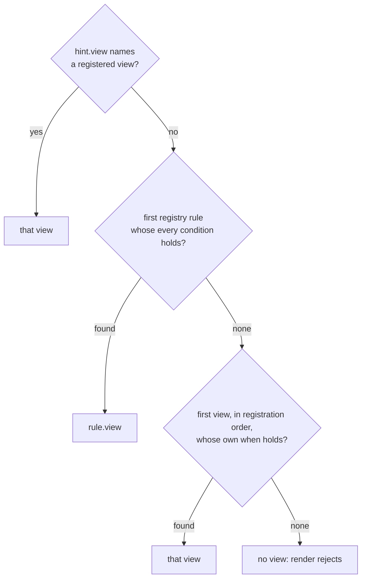

A view carries its own `when`, the conditions under which it applies by
default. The registry's rules are the user's overrides, consulted first. A
registry with no rules is the common case.

```ts
type Registry = {
  parsers: Parser[]
  views: View[]
  rules?: Rule[]   // user overrides, consulted before the views' own when
}

type Rule = {
  view: string          // a View id
  when: Condition[]     // every condition must hold
}

type Condition =
  | { iri: string | RegExp }
  | { contentType: string | RegExp }
  | { container: boolean }
  | { type: string }
  | { ask: string }
```

## Order



Order is explicit and nothing else decides.

## Every condition of a `when` must hold

A `when` is a list, and the list is an AND. This holds for a rule's `when`
and for a view's own, which are the same field with the same meaning:

```ts
// a Turtle document that is also a container
when: [{ contentType: 'text/turtle' }, { container: true }]
```

There is no OR. A view that applies to two unrelated shapes is registered
twice, or reached by two rules, or widens its condition. An empty `when`
holds for everything, which falls out of the same rule and is how a
fallback view is registered last.

## When several views could apply

A subject typed `foaf:Person` and `schema:Person` at once is the normal
case, not the exception, and both conditions hold. There is no specificity
score and no entailment: the registry has no ontology, so `owl:sameAs`,
`rdfs:subClassOf` and the rest do not enter into it. Two views that both
hold are settled by position, the first one in the list.

That is the whole tie-break, and it puts the burden where it can be seen:

- A host that wants one vocabulary to win registers that view earlier.
- A view that covers several vocabularies needs one registration per
  vocabulary, since a `when` is an AND and a single view cannot say "either
  of these" (see below).
- Collapsing vocabularies onto one canonical form before selection is a
  parser's job or a host's, and the library does not do it for you. An empty `when` holds for
everything, which is how a fallback view is registered last.

## Conditions

| Condition | Holds when |
|---|---|
| `iri` | the resource's IRI equals the string or matches the regular expression |
| `contentType` | the resource's media type, parameters stripped, equals the string or matches the regular expression |
| `container: true` | `meta` contains `<iri> rdf:type ldp:Container`; `false` holds when it does not |
| `type` | `graph` contains `<iri> rdf:type <type>`; never holds when `graph` is absent |
| `ask` | a SPARQL ASK over `graph` and `meta` together. **Not usable today:** the core has no RDF engine and `Registry` has no slot to register an evaluator in, so this condition never holds. It is in the grammar because a Fresnel lens with an instance domain becomes one |

`ask` is the condition a Fresnel lens with an instance domain becomes, where
the lens applies to resources of a certain shape, whatever their class. The
core cannot evaluate it, since it has no RDF engine.

`iri` pins a view to one resource, whatever that resource contains. A
greeting at the one IRI a deployment answers with its own document is what
it was added for, and a rule list is where a reader pins a view to a
resource of their own:

```json
{
  "view": "https://example.org/views#Dashboard",
  "when": [{ "iri": "https://pod.example/notes/Today.md" }]
}
```

## Why the rule list is data

The shape of a `Rule` is plain data so that the list can become a pod
resource the user edits. A view's IRI is dereferenceable for the same
reason: a description of the view can live at its IRI, and a host can load a
view by pointing at it.
