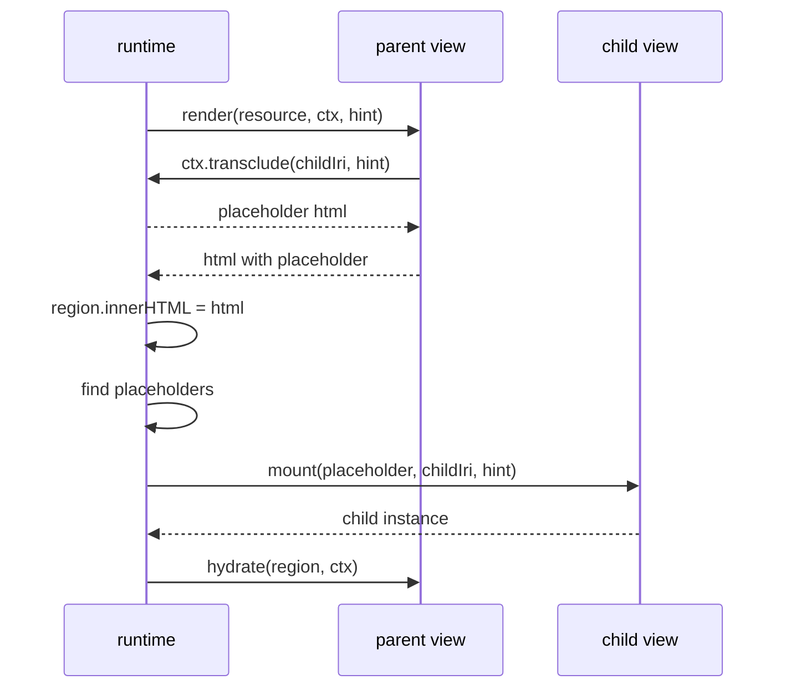

# Transclusion: design (slice 2)

A view can bring another resource in by reference, and what comes in has a
life of its own: its own region, hint, dependencies and re-render. This is
the one addition slice 2 makes to the contract of
[slice 1](2026-09-17-aleph-view-design.md). Everything else here is how a
host makes it affordable.

## Purpose

Slice 1 renders one resource per mount. A Markdown embed re-renders the
embedded note inside the view, privately, so a change to the embedded note
rebuilds the whole embedding one, and nothing outside the Markdown view can
compose resources at all.

With transclusion a layout is a resource that names other resources, the
tab strip of a desktop host is a container of IRIs, and a change to one
transcluded resource touches one instance. The web itself becomes
addressable the same way: an external page is a resource a host resolves,
and the view table decides how it is shown.

## The line

Identity is the IRI. Anything addressable can be transcluded: a note, a
container, a query, a block with an id, an external page. Anything without
an IRI is rendered inline by the view that owns the resource it lives in.
A paragraph without a block id has no IRI, so no one can point at it, so
there is nothing to transclude.

A link points at a resource; a transclusion brings it in. Both take an
IRI, and the view chooses which one a reference becomes: a wikilink stays
a link, an embed is a transclusion.

`resolve` hands out data. `transclude` hands out an instance. Two calls,
because a resource must never have to know whether it is currently data or
an instance.

## Contract delta

```ts
type Context = {
  resolve(iri: string): Promise<Resource>
  emit(event: Event): void
  events: AsyncIterable<Event>
  transclude(iri: string, hint?: Hint): Promise<string>   // new
}

type Hint = {
  view?: string
  fragment?: string
  clip?: boolean      // new: render the fragment alone, without the rest
}
```

`transclude` returns HTML the calling view inserts into its own output
verbatim. It never returns DOM. A view does not know, and must not depend
on, whether the string is the rendered child or a placeholder a host fills
in later.

`clip` is what separates an embed of `note.md#Setup` from navigating to it:
the embed shows the section alone, the navigation shows the note scrolled
to it. A view that does not understand `clip` ignores it.

## What a host does with it

### Browser runtime

The runtime answers `transclude` with a placeholder element:

```html
<div data-aleph-transclude="<iri>" data-aleph-hint="<json>"></div>
```

After it has placed the parent's HTML, it walks the region for
placeholders and mounts a child instance into each. A child is an
`Instance` like any other: own region, own handle, own dependencies, own
events with `actor` set to its id. It is disposed with its parent.



Children are mounted before the parent's `hydrate`, so a parent that wants
to react to its children in `hydrate` finds them rendered.

**Keyed children.** When a parent re-renders, its placeholders are matched
to its existing children by `(iri, hint)`. A child whose key is still
present keeps its instance: the runtime moves the child's region into the
new placeholder and calls nothing on the child. A child whose key is gone
is disposed; a new key gets a new mount. Without this, every parent change
would cascade into every child.

**Cycle and depth.** The runtime carries the chain of ancestor IRIs on each
instance. A transclusion whose IRI is already in the chain, or whose chain
is deeper than the runtime's limit, is answered with an element carrying
`data-aleph-cycle` and the IRI, and no mount. Views carry no guard of their
own.

**Dispatch by index.** The runtime keeps `IRI → instances that resolved
it`. An `as:Update` reaches the instances in that set and no other. With a
page of many instances this is the difference between O(affected) and
O(all).

### Resolve cache

The host keeps one cache in front of `resolve`, keyed by the IRI without
its fragment. A `Resource` is reused while its `ETag` or `Last-Modified`
stands, and dropped by an `as:Update` naming it. Ten block transclusions
from one note are one fetch. Fragment IRIs resolve to the whole resource;
what to show of it is the view's, through `hint.fragment` and `clip`.

The cache is the host's, so a server-side host that already holds the
store needs none, and a desktop host can make it persistent.

### Server-side host

A server-side host has no instances. It answers `transclude` by rendering
the child inline and returning the HTML, with the same cycle and depth
guard, so one document comes out complete.

## The Markdown view under it

`![[Note]]` becomes `ctx.transclude(target)`. `![[Note#Heading]]` and
`![[Note#^block]]` become `ctx.transclude(target, { fragment, clip: true })`.
The view's private embed recursion, depth limit and cycle guard go away;
the runtime has them.

With `clip`, the Markdown view renders the heading's section (up to the
next heading of the same or higher level) or the block alone. Without
`clip`, `fragment` scrolls and flashes as in slice 1.

An embedded note is a child instance, so a wikilink click inside it is an
`as:View` from that child, and an `as:Update` on it re-renders it alone.

## Acceptance

Unit, in the repository:

- a placeholder in a parent's HTML becomes a mounted child instance before
  the parent's `hydrate` runs, and is disposed with the parent
- a parent re-render keeps a child with an unchanged key (its render count
  stays at one), disposes a child whose key vanished, mounts a new key
- a transclusion of an ancestor, and one past the depth limit, produce the
  cycle marker and no mount
- `as:Update` on a child's IRI re-renders the child and leaves the parent's
  render count unchanged
- the resolve cache answers a second resolve of the same IRI, and of a
  fragment of it, without calling the host, and drops on `as:Update`
- the Markdown view emits a placeholder for an embed, and renders a section
  or block alone under `clip`

Against `pod.toph.so`, by hand: a note that embeds another renders it in
place; editing the embedded note in Obsidian and reloading updates the
embed and nothing else visible; an embed of a heading shows the section
alone.

## Rejected

- **`resolve` returning something transcludable.** Then a resource would
  carry the knowledge of whether it is data or an instance, and every view
  would have to ask. Two calls keep the choice at the call site.
- **Element-level renderers.** A `<p>` has no IRI. Give it a block id and
  it is a fragment, and fragments are already covered.
- **Guards in views.** A cycle guard per view is a cycle guard per bug.

## Deferred

- **Lazy mount.** Placeholders outside the viewport mounted on visibility.
  Worth doing after a measurement shows a page where it matters.
- **Layout resources.** RDF that names regions and their IRIs, and a
  layout view that transcludes them. The second user of transclusion,
  with its own question of what a layout looks like in RDF.
- **A desktop host.** `resolve` with a cookie jar per origin, a
  `text/html` parser that lifts RDFa and JSON-LD into `graph`, and a
  webview view as the fallback for pages that stay opaque.
