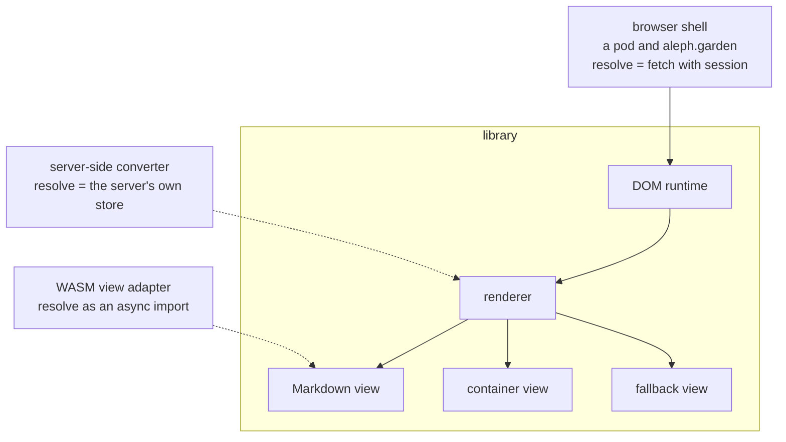
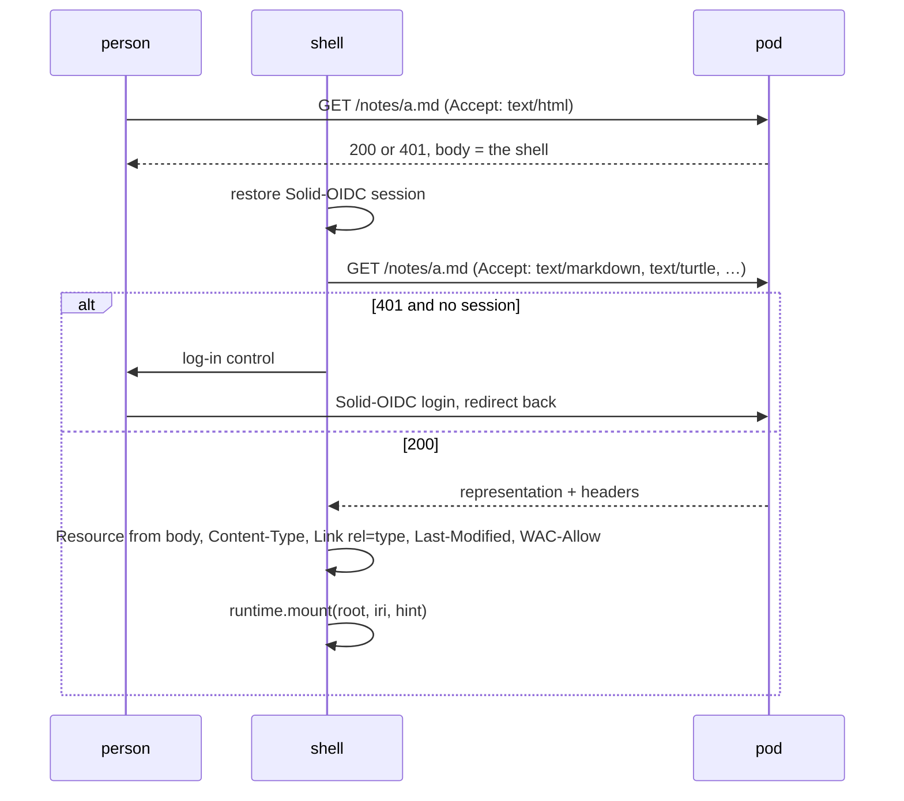

A host implements `resolve`, owns session, navigation, and layout, and calls
the runtime. Views know nothing about which host runs them.



Solid lines exist today; dotted ones are the adapters the contract is cut
for.

## The browser shell

A single HTML page with one bundle, deployed twice. A Community Solid Server
serves it as the `text/html` representation of every resource, including on
a `401`, so the page loads at the resource's own URL and the address bar is
the resource. `https://aleph.garden` serves the same bundle for any IRI a
visitor puts after its origin. The two deployments differ in one document,
the host document below.



The fetch is a second request for the same resource. The slot that serves
the shell is a constant document, so it cannot carry the representation
along; a server-side host removes that round trip.

### Addresses

The shell reads the IRI it shows from `location` alone, in one of two forms:

| Location | IRI on show |
|---|---|
| `https://pod.toph.so/notes/a.md` | the location itself |
| `https://aleph.garden/https://pod.toph.so/notes/a.md` | `https://pod.toph.so/notes/a.md` |

A path that begins with `https://` or `http://` is the IRI; every other
location is its own IRI. The prefixed form stays readable and copyable, and
the browser's own history works on it.

The direction back, from an IRI to the location that shows it, goes by
origin. An IRI on the shell's origin keeps its URL, and the shell reads that
URL the way it reads the address bar, so a shell location someone pasted
resolves to the resource it names. An IRI on another origin is shown at
`<shell origin>/<iri>`. On a pod that leaves every link the pod's own
resources carry as it is; on aleph.garden everything the site does not serve
itself takes the prefixed form, what the IRI field opens included.

Static files win over the shell: `/docs/view/` is served as the page it is,
since the path names no IRI.

### The host document

A deployment is configured by one JSON-LD node of type `view:Host` that the
build embeds into the page as `<script type="application/ld+json">`. The
shell finds it by script type and `@type`, reads the keys as they are, and
never expands the document. The context is what makes the keys IRIs when the
document is read as RDF, so the same document can later live on a pod as the
user's own rule list.

| Key | Effect |
|---|---|
| `issuer` | the Solid-OIDC issuer the login control goes to. Absent: the chrome asks for a WebID and reads `solid:oidcIssuer` from that profile |
| `sparqlEndpoint` | where the Markdown view sends `sparql` blocks. Absent: those blocks render as code |
| `views` | the ids of the bundle's views to register, in that order. Absent: every view the bundle has |
| `rules` | the registry's override rules, as [Selection](/docs/view/selection/) reads them |

aleph.garden's document registers two views and pins the landing view to the
site's own IRI:

```json
{
  "@context": "https://w3id.org/aleph/ns/view",
  "@id": "https://aleph.garden/",
  "@type": "Host",
  "views": ["https://w3id.org/aleph/ns/view#Landing", "https://w3id.org/aleph/ns/view#Fallback"],
  "rules": [
    {
      "view": "https://w3id.org/aleph/ns/view#Landing",
      "when": [{ "iri": "https://aleph.garden/" }]
    }
  ]
}
```

A pod's document names an issuer and an endpoint and leaves `views` out, so
the whole bundle is registered, the Markdown view included:

```json
{
  "@context": "https://w3id.org/aleph/ns/view",
  "@id": "https://pod.toph.so/",
  "@type": "Host",
  "issuer": "https://pod.toph.so/",
  "sparqlEndpoint": "https://sparql.toph.so"
}
```

`@id` names the host for the RDF reading and nothing else. The shell's own
origin comes from `location`, so preview deploys and the dev server work
under any origin. A hint naming a view a deployment left out is ignored, so
a view outside `views` has no path to it.

### Navigation

The shell listens for `as:View`. Another resource is a fresh `mount` into
the region; the same resource with a new fragment is a `dispatch` and no
refetch. The address follows either, in the form the rule above gives for
that IRI, and `popstate` runs the same two branches in reverse. A `view`
query parameter on the URL becomes `hint.view`, the hash becomes
`hint.fragment`.

### The chrome

Login, the IRI field, and the name of what is on show sit outside the
region, on every host. Session belongs to the host, so no view renders
these, and credentials are typed at the issuer.

- The host name and the IRI of the resource on show, kept current from the
  runtime's events and mirrored into `document.title`. A visitor at
  `https://aleph.garden/https://bank.example/` reads that the content is
  bank.example's and the frame around it is Aleph Garden's, the way a
  reader mode or a translation proxy says it.
- A field that takes an IRI and dispatches an `as:View` through the runtime,
  which navigation then follows.
- The login control: a button to the issuer the host document names, or,
  where the document names none, a field that takes a WebID and resolves the
  issuer from its profile.

A `401` without a session leaves one sentence in the region. The way back in
is the chrome's control.

### Foreign content

On aleph.garden, what fills the region comes from whatever origin the IRI
names. Views are trusted code: a visitor trusts the bundle's views, their
own, or those of a party they chose, and a view from anywhere else never
runs. Trust covers intent and leaves bugs out, and the renderers a view
leans on have had injection bugs before, KaTeX and mermaid both carrying XSS
advisories. So the resource is treated as the adversary and a view as the
path it takes: a string until the view turns it into HTML.

Isolation comes in two stages, and the browser provides both.

**In the document, on every host.** This stage stands today.

- One chokepoint. The runtime is the only code that writes a view's HTML
  into the document, on mount and on every patch, and it writes through a
  sanitizer whose allowlist admits what the views emit: the HTML, SVG and
  MathML profiles, `data-slot` for patches, `target` and `download` on
  links. A view emits a string and never touches the region itself.
- A Content Security Policy on the shell document: scripts from the bundle's
  origin, no inline script, no `object`, no `base`. A string that slipped
  past the sanitizer still runs nothing. aleph.garden sets it on the shell's
  paths and leaves the docs pages out, since Starlight's pages carry inline
  scripts of their own. How the pod sets the header is open.
- Trusted Types where the browser has them. One policy, named `aleph`,
  produces every `TrustedHTML` the bundle writes, and its `createHTML` is
  the sanitizer, so a DOM sink anywhere in the bundle refuses a plain
  string.

A policy narrows what a bug can do and draws no boundary. The origin is the
one boundary the browser has, and aleph.garden's origin holds the session.

**Across an origin, on aleph.garden.** The region becomes a sandboxed iframe
with an opaque origin. A view's `render` and `hydrate` run inside it without
cookies, storage, or the session; the shell outside holds the session and
the chrome and answers `resolve` over a message channel, which also lets it
decide which IRIs a view reaches with the visitor's credentials. A bug in a
renderer then yields script in an origin that owns nothing. The contracts
were shaped for that crossing: `render` returns a string, events go in,
patches come out, and `resolve` is the one call back.

This stage is the precondition for any view beyond the fallback view on
aleph.garden. The two views registered there today live under the first
stage: the landing view renders fixed HTML, and the fallback view escapes
everything it shows and has no `hydrate`. The Markdown view joins once the
second stage stands. A pod stays at the first stage, where the content is
the owner's and shares the origin anyway.

## Server-side host

A representation converter inside the pod server calling the same
renderer. `Rendered.html` is all it needs. It can embed the representation
in the document it serves, so a shell hydrates without a second request.

## WASM views

A view implemented as a WebAssembly component: `resolve` as an async
import, `render` as an export, wrapped by an adapter that implements `View`.
Interactivity through an event stream in and patches out, which is what
`Handle.update` already is. Nothing in `Resource` has a prototype, which is
what lets it cross that boundary as data.
