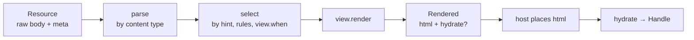

`@aleph-garden/view` turns an IRI into HTML. One IRI goes in, HTML comes
out, and the piece that decides how is a plain rule table over a list of
views. What the library sees of a resource is its body, its content type,
what the server says about it, and quads when the body carries RDF; the core
knows no server and no protocol, so a host fetches and the library renders.
RDF is where the rule table earns its keep, since a condition can select a
view by the resource's `rdf:type`.

The hosts that exist speak Solid. The first view renders Obsidian-flavored
Markdown, and a Community Solid Server hands the browser shell out as the
`text/html` representation of every resource it serves. The same shell runs
at `https://aleph.garden/`, where it renders its own landing view and opens
any IRI written after the origin.

This section is the public contract: the data that crosses the boundary,
the selection rule, the re-render protocol, and what a host owes the
library. Everything a view can do, it does through these.

## The pipeline



The core has no RDF library and no DOM. Parsers and views bring their own
libraries; the core knows quads only as plain data. Everything that touches
elements lives in one DOM module a browser host uses.

## What a view is

```ts
type View = {
  id: string                 // an IRI
  when?: Condition[]         // where it applies by default
  render(resource, ctx, hint?): Promise<Rendered>
}
```

A view receives a `Resource`, a `Context` to reach other resources and the
event bus, and an optional `Hint`. It returns HTML and, when it needs
behavior after placement, a `hydrate` function. That is the whole surface;
see [Contracts](/docs/view/contracts/).

## Packages

| Package | Holds | Knows about |
|---|---|---|
| `@aleph-garden/view` | contracts, renderer, selection, DOM runtime with instance bookkeeping | IRIs and quads |
| `@aleph-garden/view-markdown` | the Markdown view | Obsidian, a Solid type index |
| `@aleph-garden/shell` | the browser host | Solid-OIDC, WAC, LDP, Turtle |

View IRIs and the event types the library defines live under
`https://w3id.org/aleph/ns/view#`.

## What is deliberately outside

Navigation, session, editing, search and layout belong to a host. A view
never fetches, never touches the address bar, never reaches outside its own
region. The library does not model what a view is beyond the signature
above: every case arrives as a concrete view under the same contract.
